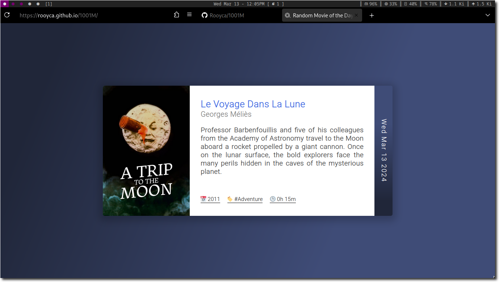

# 1001M

Everyday get one movie from the [1001 Movies You Must See Before You Die](builder/movies.json) list.

## How does it work?

- We have a list of movies in `builder/movies.json`.
- Everyday a Github Action runs and picks a movie corresponding to the day.
- The same Action populates the HTML file with the movie details.
- And finally, the `src` folder is pushed to the `gh-pages` branch.
- The website is hosted using Github Pages. You can [check it out here](https://rooyca.github.io/1001M).